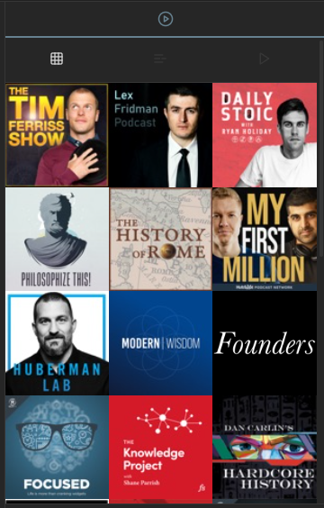
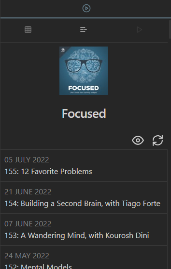
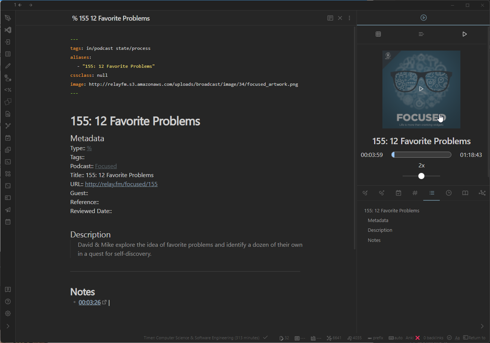

# [PodNotes](https://chhoumann.github.io/PodNotes)

<h3 align="center">You can find the documentation <a href="https://chhoumann.github.io/PodNotes">here</a>.</h3>

## Demo Video

---

The one goal for PodNotes is to make it easier to write notes on podcasts.

Here are the features that will help you do that 👇.

## Features

- Mobile friendly
- Podcast player built into Obsidian
- Add any publicly available podcast through search, or custom feeds by URL
- Track played episodes & playback progress
- Create podcast notes from templates with metadata about episodes
- Capture timestamps & link directly to the time in the episode
- Download episodes for offline playback
- Support for non-podcast local audio files
- API that can be used by plugins like [QuickAdd](https://github.com/chhoumann/QuickAdd) or [Templater](https://github.com/silentvoid13/Templater) for custom workflows

## Installation

**This plugin is in the Obsidian community plugin store. You can find it by searching in the store.**

Other installation options can be found in the [documentation](https://chhoumann.github.io/PodNotes).

## Screenshots

### Demo

### Podcast Grid

### Episode List

### Player

### Podcast Note Editing

### Podcast search

