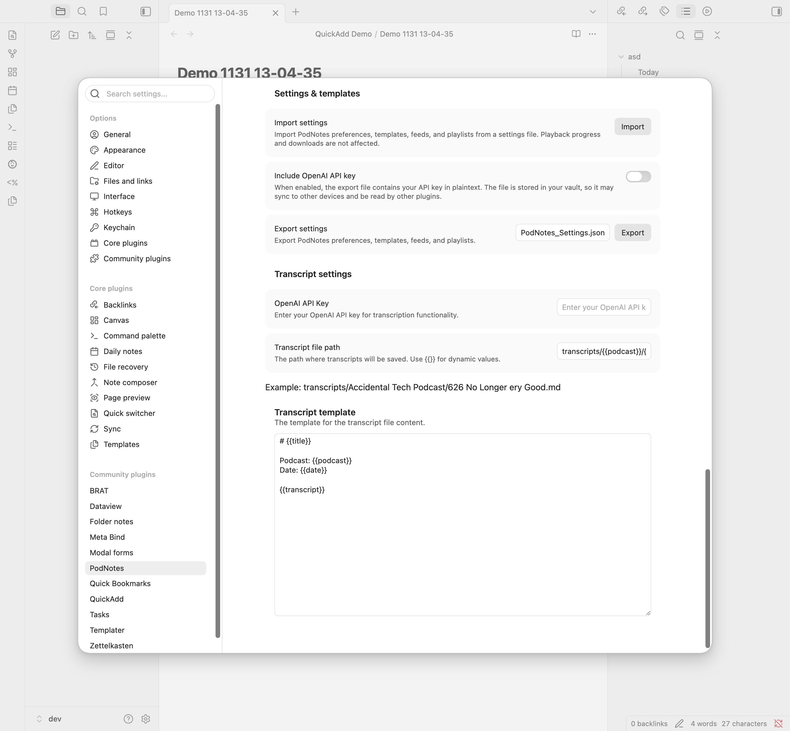

In the settings panel, you will find functionality to import and export podcasts.
This feature lets you import your saved podcasts from other apps, e.g. Pocket Casts.
Similarly, you can also export your podcasts from PodNotes to such apps.

## Importing

To import podcasts, follow these steps:

1. Go to the PodNotes settings in Obsidian.
2. Find the "Import" section.
3. Click the "Import OPML" button.
4. A file selection dialog will open. Choose your OPML file.
5. The selected podcasts will be imported into PodNotes.

## Exporting

You can export your saved feeds to `opml` format.
First designate a file path to save to (or use the default), and click _Export_.

## Settings & templates

Under the **Settings & templates** heading you can move your PodNotes
configuration between vaults or back it up. This covers your preferences,
note/timestamp/transcript templates, file paths, saved feeds, and playlists.

Playback progress, downloaded-episode bookkeeping, the currently-playing
episode, and the episode-to-note mapping are **not** included, because they are
specific to a single vault.

### Exporting settings

1. (Optional) Enable **Include OpenAI API key** if you also want your key in the
   file. The key is written in plaintext, so only do this for files you keep
   private — the file lives in your vault and may sync to other devices or be
   read by other plugins.
2. Set a file name (or keep the default `PodNotes_Settings.json`).
3. Click **Export**. The settings file is written to your vault.

### Importing settings

1. Click **Import** next to _Import settings_ and choose a settings file. Both a
   PodNotes export file and a raw `data.json` are accepted.
2. Confirm the import. Your current preferences, templates, feeds, and playlists
   are replaced with the imported values; playback progress and downloads are
   kept.

A file exported by a newer version of PodNotes is rejected until you update the
plugin. If an episode is already open when you import, a changed default playback
rate applies to the next episode you open.