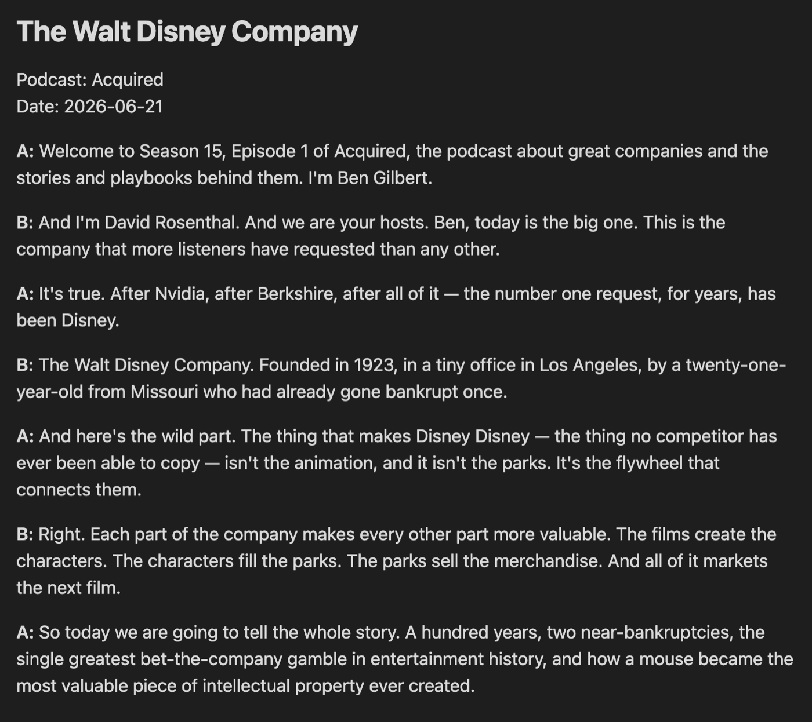
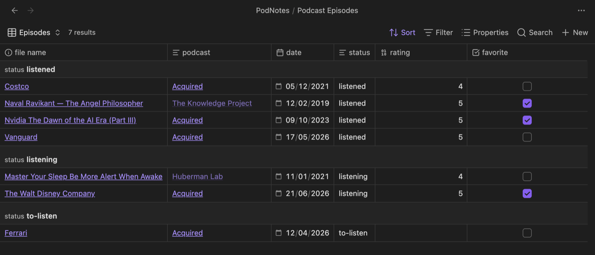

# PodNotes

The one goal for PodNotes is to make it easier to write notes on podcasts.

Here are the features that will help you do that 👇.

## Features

- Mobile friendly — works on iOS and Android, including offline playback of local files and downloads
- Podcast player built into Obsidian, for both audio and video episodes
- Add any publicly available podcast through search, or custom feeds by URL
- Track played episodes & playback progress, with continuous resume
- Create podcast notes from templates with rich metadata about episodes
- Bases-friendly default notes you can sort, filter, and group with [Obsidian Bases](https://help.obsidian.md/bases)
- Create a feed note for an entire podcast that every episode note links back to
- Capture timestamps & link directly to the time in the episode
- [Transcribe episodes](transcripts.md), with optional speaker labels (diarization)
- Download episodes for offline playback
- Support for non-podcast local audio and video files
- API that can be used by plugins like [QuickAdd](https://github.com/chhoumann/QuickAdd) or [Templater](https://github.com/silentvoid13/Templater) for custom workflows

## Installation

This plugin is in the Obsidian community plugin store. You can find it by searching in the store, or by clicking [here](obsidian://show-plugin?id=podnotes).

### Installation with BRAT

BRAT is an Obsidian plugin that helps you test beta plugins and themes. Click [here](obsidian://show-plugin?id=obsidian42-brat) to install it in Obsidian.

Add `chhoumann/PodNotes` to BRAT with the `Add a beta plugin for testing` command.

Now follow the appropriate instructions, which most likely will have you go and enable the plugin once it has finished installing.

### Manual installation

Go to the [releases](https://github.com/chhoumann/podnotes/releases/latest) page.
Download `main.js` and `manifest.json`.
Create a new directory in your Obsidian vaults `.obsidian/plugins/` folder called `podnotes` and place the downloaded files there.

Now refresh the plugins in Obsidian and enable PodNotes.

## Screenshots

### Demo

### Podcast Grid

### Episode List

### Player

Play audio and video episodes, adjust the speed, and pick up exactly where you left off.

### Episode notes

Notes are created from a template with structured, [Bases](https://help.obsidian.md/bases)-friendly frontmatter.

### Timestamps

Capture the moment you're listening to as a clickable link straight into your notes.

### Transcripts with speaker labels

Transcribe an episode and, optionally, label who said what.

### Browse your library with Bases

Because episode notes carry structured metadata, you can query them with Obsidian Bases.

### Podcast search

