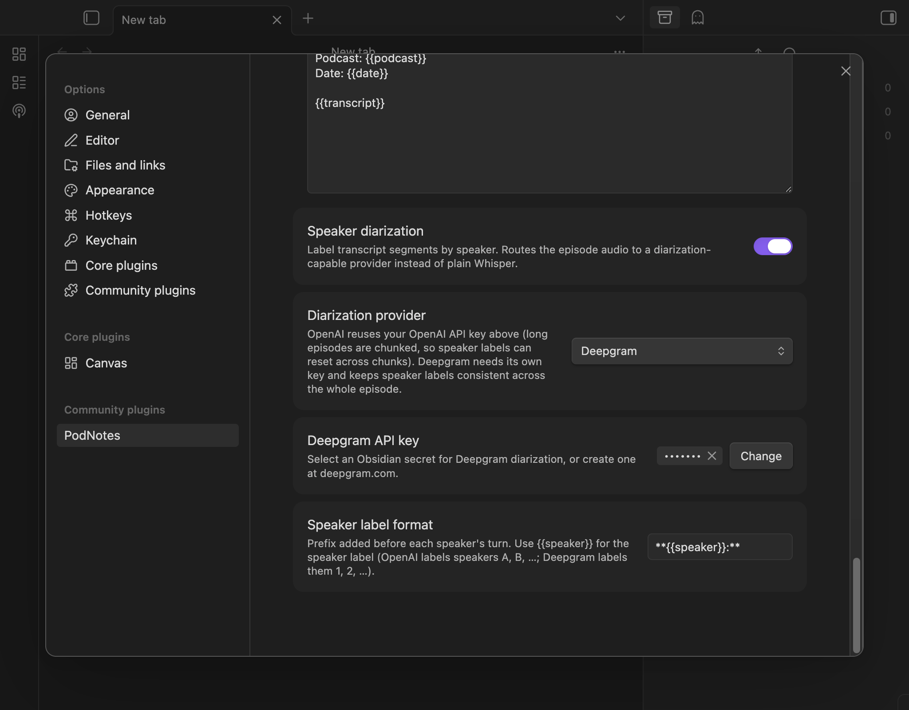

# Transcripts

PodNotes can create transcript notes from podcast episodes. Plain transcription
uses OpenAI's Whisper model, while optional speaker diarization can use OpenAI
or Deepgram.

## Setting Up

Before you can use transcription, set up the following:

1. **OpenAI API key**: Create a key at [OpenAI's website](https://openai.com/).
   In **Settings -> PodNotes -> Transcript settings**, use **OpenAI API key** to
   select an existing Obsidian secret or create one. Plain Whisper transcription
   and OpenAI diarization both use this secret.

2. **Transcript file path**: Choose where transcript files are saved. You can
   use placeholders such as `{{podcast}}` and `{{title}}` in the path.

3. **Transcript template**: Customize how the transcript note is formatted.

### How API keys are stored

PodNotes uses Obsidian's native secret picker. The API key value is kept in
Obsidian's vault-local secret storage; PodNotes stores only the selected secret
name in its `data.json`, through the `openAISecretId` and `deepgramSecretId`
references. Obsidian secrets are centralized and can be selected by other
plugins, so this is not plugin-specific isolation.

Secret values are local to the current vault on the current device. A selected
secret name can sync with the rest of the vault configuration while its value
does not. If PodNotes says that a selected secret is unavailable on this device,
open **Transcript settings** on that device and select or create the secret
again.

When upgrading from a version that stored API keys directly in `data.json`,
PodNotes moves existing OpenAI and Deepgram keys into Obsidian's secret storage
before rewriting the settings file. The plaintext fields are then removed. If
that migration cannot be completed and verified, PodNotes leaves the existing
settings file unchanged and shows a persistent notice so you can restart the
plugin and retry.

## Creating a Transcript

To create a transcript:

1. Start playing the audio episode you want to transcribe.
2. Run **PodNotes: Transcribe current episode** from the command palette.
3. PodNotes fetches the currently playing episode's audio, reusing an existing
   download when available. Plain Whisper and OpenAI diarization split large
   audio into chunks; Deepgram diarization sends the episode in one request.
4. When transcription finishes, PodNotes creates a note at the configured
   transcript path.

The command always uses the currently playing episode's own audio, regardless
of your episode download path setting. It remains available when a required
secret is missing so it can tell you which provider must be configured on the
current device.

Generated transcript notes are also available to workflow plugins through the
[PodNotes API](./api.md#transcript), so tools such as QuickAdd or Templater can
read the text and send it to the AI provider configured in your own macro.

## Transcript Template

The transcript template works similarly to the
[note template](./templates.md#note-template), with the additional
`{{transcript}}` placeholder.

## Speaker Diarization

By default, transcription uses OpenAI's Whisper model, which produces plain
text with **no speaker labels**. Speaker diarization is an opt-in setting that
labels each transcript segment by speaker:

### Enabling it

In the **Transcript settings** section, turn on **Speaker diarization** and choose a provider:

- **OpenAI** (`gpt-4o-transcribe-diarize`) reuses the OpenAI secret selected
  above. Because each request is capped at about 20 MB, a conservative margin
  under OpenAI's 25 MB request cap, a long episode is diarized in independent
  chunks. Speaker labels can therefore reset across chunk boundaries. A typical
  episode fits in one request and keeps consistent labels.
- **Deepgram** sends the whole episode in one request, so speaker labels remain
  consistent throughout the episode. Create a separate key at
  [deepgram.com](https://deepgram.com), then select an existing Obsidian secret
  or create one under **Deepgram API key**. The Deepgram secret is used only for
  Deepgram diarization and is local to the current vault and device.

Diarization is off by default, so existing transcripts and the plain-Whisper workflow are unchanged unless you enable it.

### Speaker label format

The **Speaker label format** setting controls the prefix added before each speaker's turn. Use the `{{speaker}}` placeholder for the speaker's label:

- OpenAI labels speakers `A`, `B`, `C`, …
- Deepgram labels speakers `1`, `2`, `3`, …

The default is `**{{speaker}}:** `, which renders as an `**A:**`-style bold
prefix. To spell out the word "Speaker", use `**Speaker {{speaker}}:** `. To put
each turn in a blockquote, use `> {{speaker}}: `.

The labelled transcript replaces the usual `{{transcript}}` value in your [transcript template](#transcript-template), so you don't need to change your template to use diarization.

### Cost

Diarization providers bill per minute/hour of audio (separately from any plain-Whisper usage). As of mid-2026, OpenAI's diarize model is roughly $0.006 per minute, and Deepgram's diarized pre-recorded transcription is roughly $0.0068 per minute. Check each provider's current pricing before transcribing long back-catalogues.
